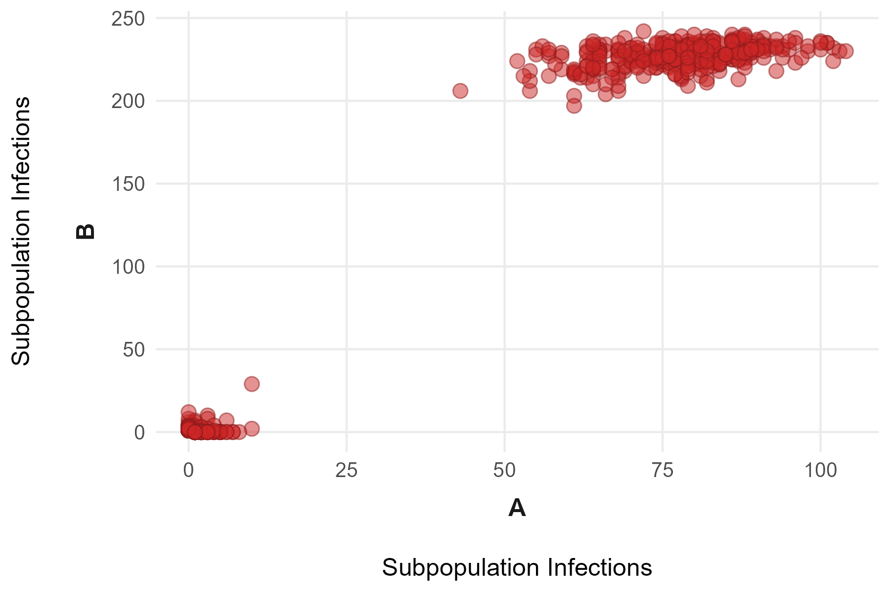
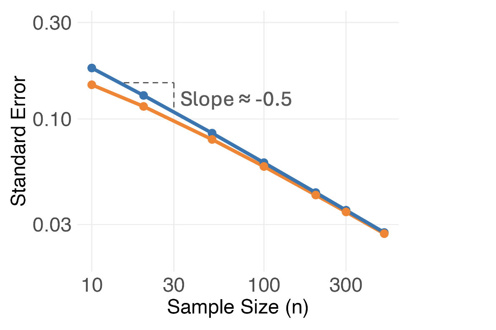

# master_thesis_2025

All files are listed below with information about what their code contains and examples of figures, that were created.

**NB: Due to data protection regulations, the data is not published. This causes several of the files to fail running.**

## functions.R

All functions are gathered in this file. This keeps maintaining and updates easy.

## ABM_improved.R

Simulations of agent based models (ABMs).

{width="430"}

{width="431"}

{width="300"}

## Binomial_Conditional_P.R

For age-specific data analysis. 

{width="431"}

## Censored_MLE_R.R

Computes maximum likelihood estimates of R for countries with at least 20 outbreaks of size minimum 5.

Also computes bootstrap CI and Fisher CI.

## descriptive_analysis_of_data.R

Produces all the numbers included in the descriptive analysis of TESSy data in the report.

## LLRT_Wald_test.R

For testing distributions against each other.

Also bootstrap test.

## outbreak_distributions_plots.R

Contains cumulative distribution plots of countries with at least 20 outbreaks of size minimum 5.

All plots assumes x = 1 is not in the data.

.png){width="430"}

## q(x).R

The function q(x) from Jansen & Stollenwerk is implemented. It's the probability of an outbreak size being exactly of size x.
Further, uncertainty associated with sample size its included.

_simulations.png){width="430"}

{width="300"} {width="300"}

## q(x)\_cumulative.R

The function q(x) from Jansen & Stollenwerk is implemented cumulative. It's the probability of an outbreak size being of size x or greater.

_cumulative.png){width="430"}

## QQ.R

Produces QQ plots of outbreak size distributions from empirical data estimated R's.

{width="430"}

## Timeseries_outbreaks.R

Plots the outbreaks over time.

{width="430"}
